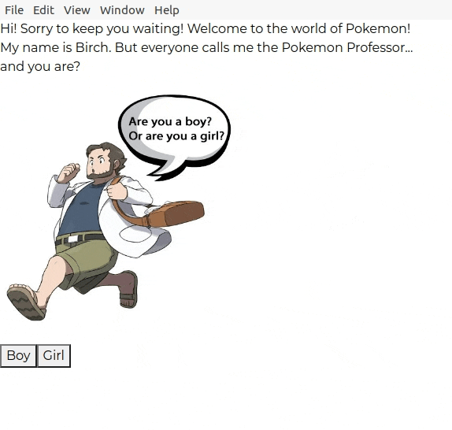

[![Contributors][contributors-shield]][contributors-url]
[![Forks][forks-shield]][forks-url]
[![Stargazers][stars-shield]][stars-url]
[![Issues][issues-shield]][issues-url]
[![MIT License][license-shield]][license-url]
[![LinkedIn][linkedin-shield]][linkedin-url]

<!-- PROJECT LOGO -->
<br />
<p align="center">
  <a href="https://github.com/chaomonica/poke-catcher">
    
  </a>

  <h3 align="center">PokeCatcher</h3>

  <p align="center">
    A learning project on Electron to create a fun, interactive app to catch pokemon!
</p>

<!-- TABLE OF CONTENTS -->
<details open="open">
  <summary>Table of Contents</summary>
  <ol>
    <li>
      <a href="#about-the-project">About The Project</a>
      <ul>
        <li><a href="#built-with">Built With</a></li>
      </ul>
    </li>
    <li><a href="#installation">Installation</a></li>
     <li><a href="#roadmap">Roadmap</a></li>
    <li><a href="#license">License</a></li>
    <li><a href="#contact">Contact</a></li>
    <li><a href="#acknowledgements">Acknowledgements</a></li>
  </ol>
</details>

<!-- ABOUT THE PROJECT -->

## About The Project



PokeCatcher is built as a desktop app which allows generates random Pokemon and allows the user to attempt to catch said Pokemon. Features that mirrored the original games were added for the nostalic feels!

Key Features:

- Desktop app
- Meeting the confused professor
- Randomly generated Pokemon
- Option to catch, throw rocks at, or feed Pokemon
- Sending Pokemon to the pokebox
- Visiting Pokemon at the Professor (caught Pokemon persistency)

### Built With

- [React](https://reactjs.org/)
- [React Bootstrap](https://react-bootstrap.github.io/)
- [Postgres](https://www.postgresql.org/)
- [Electron](https://www.electronjs.org/)

### Installation

1. Clone the repo
   ```sh
   git clone https://github.com/chaomonica/poke-catcher.git
   ```
2. Install NPM packages
   ```sh
   npm install
   ```
3. Start the React app
   ```sh
   npm start
   ```
4. Start Electron
   ```sh
   npm run electron-start
   ```

<!-- ROADMAP -->

## Roadmap

See the [open issues](https://github.com/othneildrew/Best-README-Template/issues) for a list of proposed features (and known issues).

<!-- LICENSE -->

## License

Distributed under the MIT License. See `LICENSE` for more information.

<!-- CONTACT -->

## Contact

Project Link: [https://github.com/chaomonica/poke-catcher](https://github.com/chaomonica/poke-catcher)

<!-- ACKNOWLEDGEMENTS -->

## Acknowledgements

- [GitHub Emoji Cheat Sheet](https://www.webpagefx.com/tools/emoji-cheat-sheet)

<!-- MARKDOWN LINKS & IMAGES -->
<!-- https://www.markdownguide.org/basic-syntax/#reference-style-links -->

[contributors-shield]: https://img.shields.io/github/contributors/chaomonica/poke-catcher.svg?style=for-the-badge
[contributors-url]: https://github.com/chaomonica/poke-catcher/graphs/contributors
[forks-shield]: https://img.shields.io/github/forks/chaomonica/poke-catcher.svg?style=for-the-badge
[forks-url]: https://github.com/chaomonica/poke-catcher/network/members
[stars-shield]: https://img.shields.io/github/stars/chaomonica/poke-catcher.svg?style=for-the-badge
[stars-url]: https://github.com/chaomonica/poke-catcher/stargazers
[issues-shield]: https://img.shields.io/github/issues/chaomonica/poke-catcher.svg?style=for-the-badge
[issues-url]: https://github.com/chaomonica/poke-catcher/issues
[license-shield]: https://img.shields.io/github/license/chaomonica/poke-catcher.svg?style=for-the-badge
[license-url]: https://github.com/chaomonica/poke-catcher/blob/master/LICENSE.txt
[linkedin-shield]: https://img.shields.io/badge/-LinkedIn-black.svg?style=for-the-badge&logo=linkedin&colorB=555
[linkedin-url]: www.linkedin.com/in/monica-chao
[product-screenshot]: images/screenshot.png
